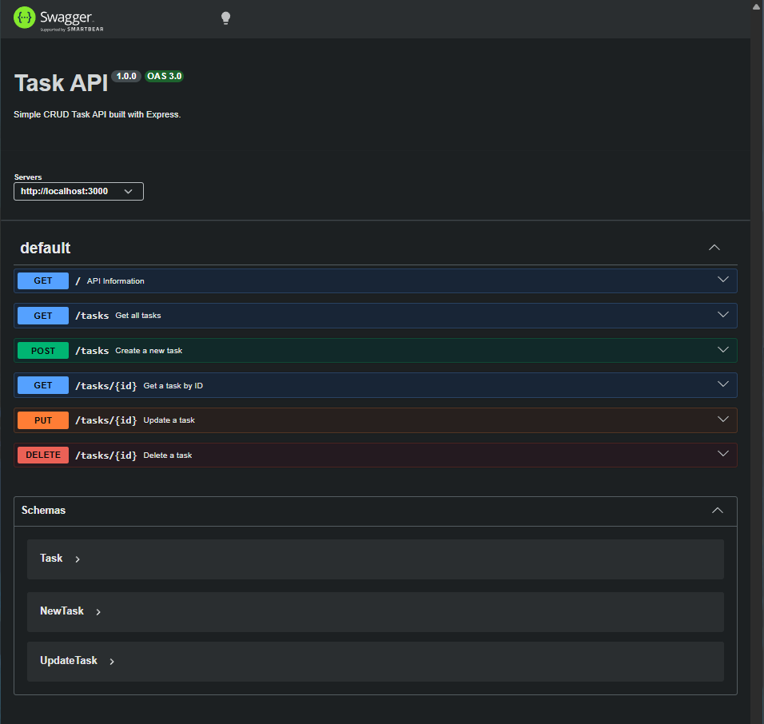

# Build your first CRUD API

A simple RESTful Task API built with **Node.js**, **Express**, and **Swagger UI** as part of the FlyRank Backend Internship Week 2 assignment.

The project demonstrates the fundamentals of backend development by implementing a complete CRUD (Create, Read, Update, Delete) API using an in-memory array instead of a database.


---

## Features

- Express.js REST API
- In-memory task storage
- CRUD operations
- Input validation
- Proper HTTP status codes
- Swagger UI interactive documentation
- JSON request/response format

---

## Tech Stack

- Node.js
- Express.js
- Swagger UI Express

---

## Installation

### 1. Clone the repository

```bash
git clone https://github.com/yourusername/task-api.git
cd task-api
```

### 2. Install dependencies

```bash
npm install
```

### 3. Run the server

```bash
node index.js
```

The server starts at

```
http://localhost:3000
```

Swagger documentation is available at

```
http://localhost:3000/docs
```

(or `/api-docs` if you kept that route.)

---

# API Endpoints

| Method | Endpoint | Description |
|---------|----------|-------------|
| GET | `/` | API information |
| GET | `/health` | Health check |
| GET | `/tasks` | Get all tasks |
| GET | `/tasks/:id` | Get a single task |
| POST | `/tasks` | Create a task |
| PUT | `/tasks/:id` | Update a task |
| DELETE | `/tasks/:id` | Delete a task |

---

# Example Request

### Create Task

```http
POST /tasks
Content-Type: application/json
```

Body

```json
{
    "title": "Buy milk"
}
```

Response

```json
{
    "id": 4,
    "title": "Buy milk",
    "done": false
}
```

---

# Sample curl Output

```bash
curl.exe -i http://localhost:3000/tasks
```

Output

```http
HTTP/1.1 200 OK
Content-Type: application/json

[
    {
        "id": 1,
        "title": "Product Inventory",
        "done": true
    },
    {
        "id": 2,
        "title": "Patient Records",
        "done": true
    },
    {
        "id": 3,
        "title": "Prescription Management",
        "done": true
    }
]
```

---

# Swagger UI

The API is documented using **Swagger UI**.

It allows interactive testing of every endpoint directly from the browser without using curl.

Available at:

```
http://localhost:3000/docs
```

(or `/api-docs` depending on your configuration.)

### CRUD Demonstration

The following operations were successfully tested using Swagger UI:

- Create a task
- List all tasks
- Update a task
- Delete a task

---

## Swagger Screenshot


---

# Project Structure

```
task-api/
│
├── index.js
├── swagger.json
├── package.json
├── package-lock.json
├── README.md
└── node_modules/
```

---

# Learning Outcomes

This project helped me understand:

- REST API fundamentals
- Express routing
- HTTP methods (GET, POST, PUT, DELETE)
- HTTP status codes
- Request parameters
- Request body validation
- CRUD operations
- JavaScript array methods (`find`, `findIndex`, `splice`)
- Swagger/OpenAPI documentation
- Testing APIs using curl, PowerShell, and Swagger UI

---

# Commit History

- Stage 0: Hello Server
- Stage 1: Root and Health Endpoints
- Stage 2: Read Endpoints with 404
- Stage 3: Create with Validation
- Stage 4: Full CRUD
- Stage 5: Swagger UI
- Stage 6: Publish and Documentation

---

Note (Windows Users): Some curl commands in the assignment may not work correctly in Windows PowerShell. If you encounter issues, use Invoke-RestMethod or test the API through Swagger UI (/docs).

Created as part of the **FlyRank Backend Internship – Week 2 Assignment**.
